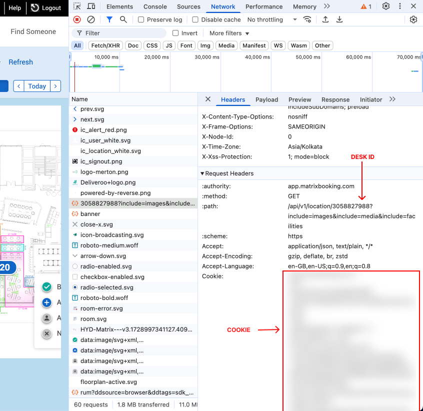
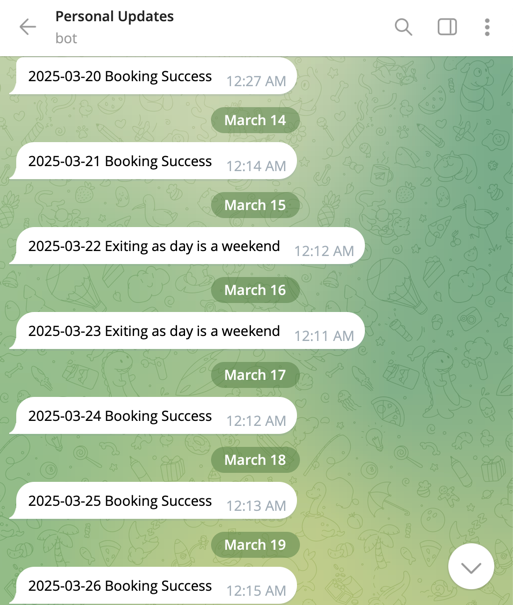

# Matrix Booking Automation

## Overview

This repository automates the process of booking and checking in for a desk using GitHub Actions. It sets up two recurring actions:

- **Create Booking**: Runs daily at 12 AM to schedule a booking 7 days in advance. For example, on March 1st, it books for March 8th.
- **Check-in**: Runs daily at 9 AM to automatically check in for a valid booking.

These actions are configured to run every day except weekends. Please use responsibly and cancel bookings if they are not needed.

## Setup

1. **Fork this Repository**

2. **Configure Secrets**

   Navigate to your repository settings:
    - Go to **Settings** > **Secrets and Variables** (Sidebar) > **Actions** > **New Repository Secret**

- **`AUTOBOOKING_DESK_ID`**: This is the desk ID used for booking. For example, `3058825798`.

- **`AUTOBOOKING_SESSION_COOKIE`**: This is your session cookie, which is necessary for making authenticated requests on your behalf.

#### How to Obtain the Required Secrets

You can obtain these secrets from the Matrix Booking website by following these steps:

1. Go to the Matrix Booking website.
2. Open Developer Tools (usually by pressing `F12` or `Ctrl+Shift+I`).
3. Navigate to the **Network** tab.
4. Navigate to new booking page and click on your seat in the office seat map.
5. Click on the relevant network request to view and extract the necessary details.

> Note: The token typically expires in about 3 weeks, so update this secret regularly.

> Once set up, the repository schedules 7 days ahead, so you must manually book seats for the next 7 days.

### Optional Secrets (For Telegram Status Alerts)

- **`AUTOBOOKING_TELEGRAM_BOT_TOKEN`**: Obtain this from the @botfather Telegram bot by creating a new bot using the `/newbot` command.
- **`AUTOBOOKING_TELEGRAM_CHAT_ID`**: Your Telegram user ID. You can retrieve this from any user info bot, such as @UserX_RoBot.

> **Important:** After creating your bot, send it any message. This step is crucial to ensure that the bot is eligible to send you messages.

---

## Testing

You can manually run the workflow at any time:

1. Navigate to [Create Booking](../../actions/workflows/createbooking.yml) / [Check-in](../../actions/workflows/checkin.yml)
2. Click **Run Workflow**.

## Temporarily Disabling Workflows

To disable any workflow:

1. Navigate to [Create Booking](../../actions/workflows/createbooking.yml) / [Check-in](../../actions/workflows/checkin.yml)
2. Click the three dots on the right side of the page.
3. Select **Disable Workflow**.

---

**Note:** The repository is configured for the India timezone. You may need to adjust the settings to match your local timezone.